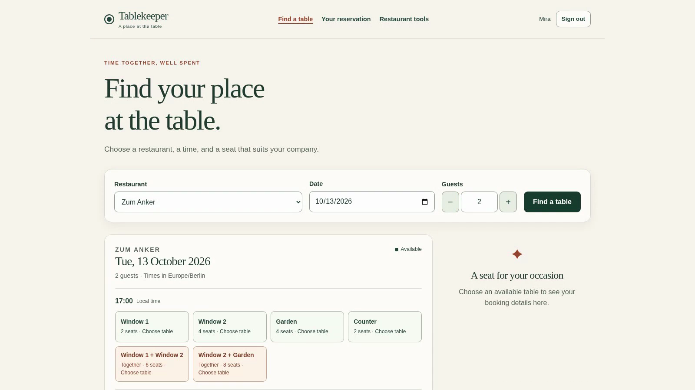
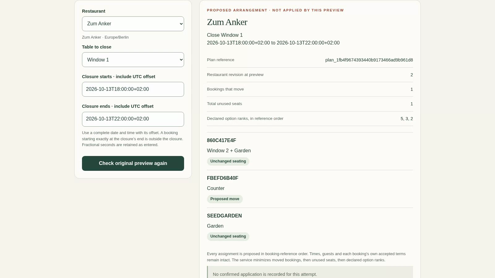
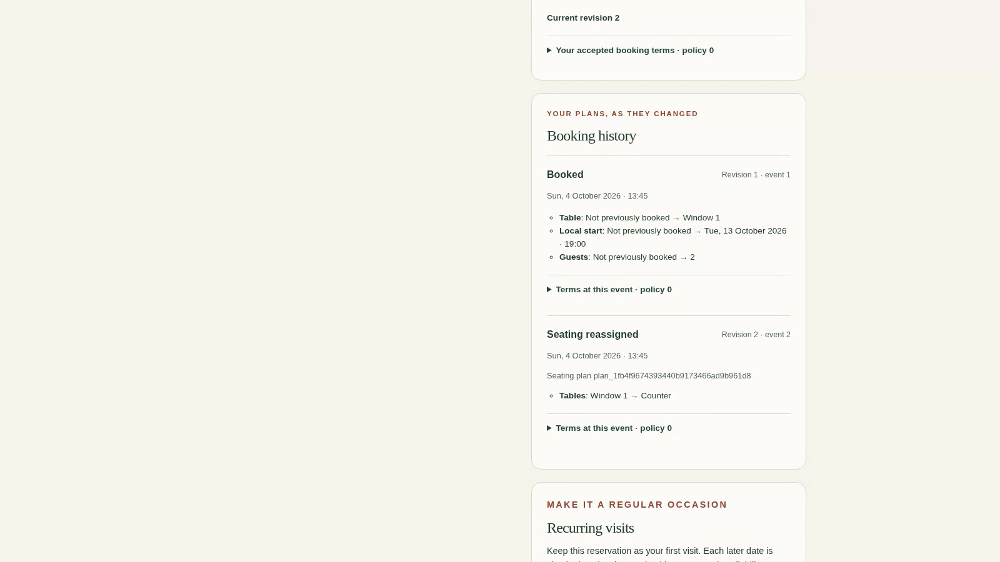

# Nightwatch Foundry

Entry for **Dark Factory** (WeAreDevelopers × BAND), track **`tablekeeper`**.
Team: Nightwatch Foundry — one human operator (Yi Yu) and a four-seat band in BAND Desktop.

Nightwatch Foundry is a software factory: four coding-agent seats share one room and turn a
single human dispatch into working software, stage by stage, with nobody outside the room
speaking again. In the scored run it built a restaurant reservation service through all
**four consecutive stages** in **10 h 39 min**.

| | |
|---|---|
| Stages completed | 4 of 4, each accepted by the independent verifier against an exact commit |
| Shipped checks, fresh clone, isolated mode | stage-1 120/120 · stage-2 25/25 · stage-3 7/7 · stage-4 6/6, every earlier suite still passing in every later folder |
| Human input in the run | one message: the dispatch |
| Review that changed the work | 6 rejections and 2 revoked acceptances, each followed by a code repair |
| Commits by the band | 381 — Foundry Coordinator 133, Independent Verifier 101, Interface Engineer 78, Systems Engineer 69 |
| Model spend | 662 million tokens to the final report (97 % cached input), subscription-billed |

Everything measured is explained in [FACTORY.md](FACTORY.md).

## How to read this repository

| Path | What it is | Written by |
|---|---|---|
| `stage-1/` … `stage-4/` | One complete, buildable service per stage (`Dockerfile`, `RUN.md`, source). Each folder is the previous one carried forward and widened | the band |
| `mandates/` | The four generic seat mandates, each starting with its harness and model | operator, before the run; copied in unchanged by the band |
| `room.json` | The whole room, downloaded from Band after the run and saved unchanged | Band |
| `FACTORY.md` | The factory: seats, setup, design choices and their cost, measured time and spend, how bad work is caught | operator |
| `factory/` | The exact dispatch, the task brief it refers to, the launch commands, and the mandates we would run next time | operator |
| `evidence/` | The band's own ledgers, coverage matrices, probes, rejected candidates and repairs. Large: about 3.7 GB checked out | the band |
| `plan.md`, `architecture.json` | The coordinator's plan and the service architecture note | the band |
| `docs/` | Three screenshots of the stage-4 product, taken from the demo recording | operator |

The operator wrote no code under `stage-N/`. Operator commits are the last ones in the
history and touch only `README.md`, `FACTORY.md`, `room.json`, `factory/`, `docs/` and the
file renames described under "Operator changes" below. The band's history is pushed as it
was made: nothing amended, rebased or squashed.

## Verify it yourself

```sh
# from a checkout of the official kickoff repository, with its virtualenv active
python -m harness check <this repository> --track tablekeeper
python -m harness run --track tablekeeper --repo <this repository> --all --mode isolated --out runs/nightwatch
```

Our own run of the second command on a fresh clone of the band's final commit `49bb986`
(2026-10-04 11:40 UTC) reported:

```text
stage-1/: claims stage 1 on the shipped checks
stage-2/: claims stage 2 on the shipped checks
stage-3/: claims stage 3 on the shipped checks
stage-4/: claims stage 4 on the shipped checks
```

These are the shipped checks only. We make no claim about the organisers' full suite.

To run the product by hand, follow `stage-4/RUN.md`:

```sh
cd stage-4
docker build -t tablekeeper-stage-4 .
docker run --rm --cpus=2 --memory=2g -e PORT=8080 -p 18200:8080 tablekeeper-stage-4
```

The service starts with an empty catalogue; load a fixture through `POST /_test/reset` as
the specification describes, then open `http://localhost:18200/`. The diner screens are
`/`, `/signup`, `/login` and `/lookup`; stage 4 adds restaurant tools at `/manage`.

| Search and availability | Manager reseating proposal | Booking history |
|---|---|---|
|  |  |  |

## Reading the room

`room.json` is the unedited "Download full session" export. The first message is the human
dispatch (2026-10-04 00:12:31 UTC); every later message comes from a seat. Useful anchors:

- **Reciprocal handoffs** — the coordinator sends each seat the full specification as a
  numbered multi-part package (`part i/N`) and each seat acknowledges every part by
  `@handle` before starting.
- **A rejection that changed the work** — search for `Reject` from the Independent
  Verifier around 00:43, 00:55, 02:34, 02:59, 04:35 and 09:16 UTC, and the repair commits
  that follow each one (table in [FACTORY.md](FACTORY.md#how-it-catches-and-recovers-from-bad-work)).
- **The final report** — the coordinator's message of 10:51:38 UTC.

After the final report the coordinator spent another 48 minutes settling queued inbound
messages one by one without changing anything; that tail is in the log too.

The export was taken on 2026-10-04 at 13:48 UTC and holds 20,512 events. On 2026-10-05 the
operator's machine restarted (13:11 UTC); Band Desktop respawned the coordinator's runtime,
which re-read the room and restated the final result at 13:13 UTC. Those 29 events, all from
the coordinator, with no human message and no commit, are in the live room but are later
than `room.json`.

## Operator changes

- Added `README.md`, `FACTORY.md`, `room.json`, `factory/` and `docs/`.
- Renamed 28 evidence files from `*.json` to `*.json.txt`, contents byte-identical. They are
  `docker inspect` output and source-code copies; the official credential scan reads
  `NAME=value` in `.json` files as an environment secret, and these files contain the
  public `GPG_KEY` of the official Python base image and code such as `password = ...`.
  No credential is involved. The mapping is in `factory/operator-renames.txt`; paths
  recorded inside the band's own manifests still show the original names.
- Absolute paths in `evidence/` and `room.json` are from the operator's machine.
